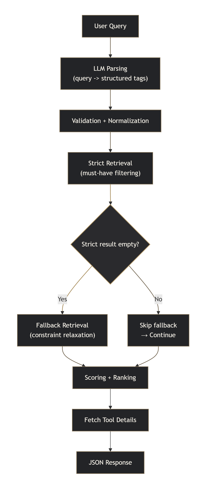

# AI Tool Recommendation Backend


## Live Demo

Frontend: https://aitool-blush.vercel.app  
Backend API: https://nd788ggkmj.execute-api.us-east-2.amazonaws.com/prod/aitool

## Overview

This project is a backend service for an AI tool recommendation system.

It helps users find suitable AI tools by converting natural language queries into structured tags, retrieving matching tools from a curated database, and ranking them with a rule-based scoring system.

Instead of relying on LLMs to directly recommend tools, this system separates:
- **LLM for query understanding**
- **structured taxonomy + database for retrieval**
- **rule-based ranking for controllable recommendations**


This improves controllability, stability, and explainability.


## Why this project

AI tools are highly fragmented across the internet. Users face two main challenges:

- High search cost (tools are scattered across websites)
- High decision cost (hard to find tools that match specific needs)

Pure LLM-based recommendations are:
- unstable
- hard to control
- prone to hallucination

This project addresses these issues using a **tag-driven recommendation pipeline**.


## Architecture

### Frontend:
- React + Vercel

### Backend:
- AWS API Gateway
- AWS Lambda (Python backend)
- MySQL (RDS)

### Pipeline:
<p align="center">
   
  <br/>
  <em>System Pipeline Overview</em>
</p>

## Backend Modules

- `handler.py`  
  API entry point and orchestration

- `datatier.py`  
  Database access layer (MySQL)

- `parser.py`  
  Prompt construction, LLM call, validation, normalization

- `retriever.py`  
  Filtering, scoring, ranking, fallback logic

- `response.py`  
  Response formatting and logging


## Database Design

The database is designed to reduce redundancy and support flexible querying.

Key design principles:
- Many-to-many relationships are decomposed into junction tables
- Core entities are normalized for scalability

Main tables:
- `tools`
- `functions`
- `use_cases`
- `price_types`
- `sources`

Mapping tables:
- `tool_function_map`
- `tool_usecase_map`
- `tool_price_map`
- `tool_source_map`


## Recommendation Logic

### Filtering (must-have)
- category
- price_type
- language
- use_cases

### Scoring
score = 3 × matched_use_case_count + 2 × matched_function_count + 1 × matched_nice_to_have_count

### Tie-break
1. matched_use_case_count
2. matched_function_count
3. tool name / id

### Fallback Strategy

If no result:
- keep category
- keep primary use case
- relax language or price_type


## API

### POST /aitool

Request:

```bash
json
{
  "query": "free chinese podcast editing tool"
}
```
Response:

```bash
json
{
  "query": "...",
  "parsed_query": {...},
  "fallback_used": false,
  "result_count": 3,
  "results": [
    {
      "rank": 1,
      "tool_id": 3,
      "name": "Tool A",
      "score": 8
    }
  ]
}
```

## Deployment (AWS Lambda)

### Runtime
- Python 3.14
- Architecture: x86_64

### Lambda Layers
This service depends on the following AWS Lambda layers:

- `pymysql-layer`  – MySQL access
- `openai-layer`  – LLM integration

### Environment Variables
The following environment variables must be configured in Lambda:

- `endpoint`
- `dbname`
- `username`
- `pwd`
- `OPENAI_API_KEY`
- `openai_model`

### Notes
- The backend is deployed via AWS Lambda + API Gateway
- No local setup is required for usage

## Design Decision

### Instead of using LLMs for direct recommendation, this project separates:
- LLM → semantic understanding
- system → decision making

### Reasons:

- improves stability
- avoids hallucination
- ensures recommendations are based on real tools
- easier to debug through CloudWatch

## Future Improvements
- improve taxonomy (reduce ambiguity)
- optimize ranking (learned weights)
- introduce embeddings for semantic matching
- collect user feedback for evaluation
- build evaluation pipeline for recommendation quality
- use LLM to interpret the rank result

## Notes

This project represents a cold-start recommendation system, where no user interaction data is available.

The system relies on structured data + rule-based ranking for the first version.

