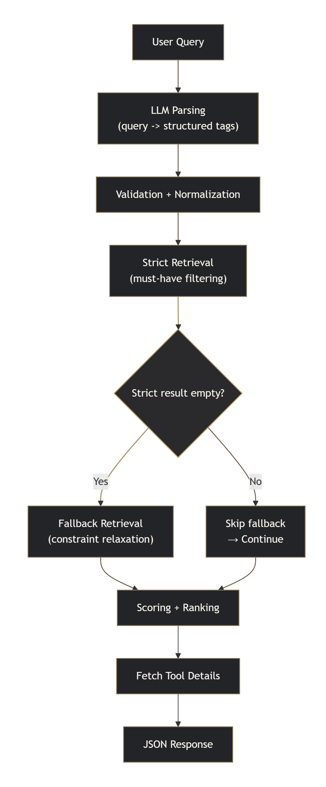

# AI Tool Recommendation Backend

## Live Demo

Frontend: https://aitool-blush.vercel.app  
Backend API: https://nd788ggkmj.execute-api.us-east-2.amazonaws.com/prod/aitool

## Overview

This project is a backend service for an AI tool recommendation system.

It helps users find suitable AI tools by converting natural language queries into structured tags, retrieving matching tools from a curated database, and ranking them with a rule-based scoring system.

Instead of relying on LLMs to directly recommend tools, this system separates:
- **LLM for query understanding**
- **structured taxonomy + database for retrieval**
- **rule-based ranking for controllable recommendations**

This improves controllability, stability, and explainability.

## Why this project

AI tools are highly fragmented across the internet. Users face two main challenges:

- High search cost (tools are scattered across websites)
- High decision cost (hard to find tools that match specific needs)

Pure LLM-based recommendations are:
- unstable
- hard to control
- prone to hallucination

This project addresses these issues using a **tag-driven recommendation pipeline**.

## Architecture

### Frontend:
- React + Vercel

### Backend:
- AWS API Gateway
- AWS Lambda (Python backend)
- MySQL (RDS)

### Pipeline:
<p align="center">
  
  <br/>
  <em>System Pipeline Overview</em>
</p>

## Backend Modules

- `lambda_function.py`  
  API entry point and orchestration

- `datatier.py`  
  Database access layer (MySQL)

- `parser.py`  
  Prompt construction, LLM call, validation, normalization

- `retriever.py`  
  Filtering, scoring, ranking, fallback logic

- `response.py`  
  Response formatting and logging

## Database Design

The database is designed to reduce redundancy and support flexible querying.

Key design principles:
- Many-to-many relationships are decomposed into junction tables
- Core entities are normalized for scalability

Main tables:
- `tools`
- `functions`
- `use_cases`
- `price_types`
- `sources`

Mapping tables:
- `tool_function_map`
- `tool_usecase_map`
- `tool_price_map`
- `tool_source_map`

Both `functions` and `use_cases` use a two-level taxonomy:
- `core`: broad requirement used as a hard filter
- `sub`: more specific label used as a stronger scoring signal

## Data Pipeline

The system uses a lightweight ETL pipeline to build a structured AI tool database.

- **Extract**: raw tool data collected from curated sources (CSV / Excel)
- **Transform**:
  - text normalization (trim, lowercase, whitespace cleanup)
  - mapping raw labels to standardized taxonomy (`core` / `sub`)
- **Load**:
  - insert tools into normalized tables
  - generate mapping tables (`tool_function_map`, `tool_usecase_map`, etc.)

This ensures the data is clean, consistent, and suitable for structured retrieval and ranking.

## Recommendation Logic

### Filtering (must-have)
- category
- price_type
- language
- use_case core tags
- function core tags

Strict filtering is applied first. A tool must satisfy all active hard constraints in the current retrieval round.

### Scoring
The current code uses two-level taxonomy scoring:
- use_case core match: `+2`
- use_case sub match: `+4`
- function core match: `+2`
- function sub match: `+4`
- nice_to_have use_case core match: `+1`
- nice_to_have use_case sub match: `+2`

`sub` has higher weight than `core`, because `sub` is the more specific signal in the project scoring mechanism.

### Tie-break
1. matched_use_case_sub_count
2. matched_function_sub_count
3. matched_use_case_core_count
4. matched_function_core_count
5. tool name / id

### Fallback Strategy

If strict filtering returns no result, the system gradually relaxes lower-priority hard constraints and retries retrieval after each single relaxation.

Relax order:
1. `functions`
2. `price_type`
3. `language`

Rules:
- `category` remains required
- `use_cases` remain the final hard requirement and are not relaxed in fallback
- only one constraint is relaxed per retry round
- retrieval stops as soon as a retry produces results
- if no retry succeeds, the API returns an empty result set together with the fallback trace

The API response includes fallback metadata so the frontend can tell the user which constraints were relaxed:
- `fallback_used`
- `relaxed_field`
- `relaxed_fields`
- `original_constraints`
- `relaxed_constraints`
- `retry_count`
- `retry_history`

## API

### POST /aitool

Request:

```json
{
  "query": "free chinese podcast editing tool"
}
```

Response:

```json
{
  "query": "...",
  "parsed_query": {
    "category": "audio",
    "must_have": {
      "price_type": ["free"],
      "language": ["chinese"],
      "use_cases": [
        {
          "core": "content creation",
          "sub": "podcast editing"
        }
      ]
    },
    "nice_to_have": {
      "use_cases": []
    },
    "functions": [
      {
        "core": "audio processing",
        "sub": "noise reduction"
      }
    ]
  },
  "fallback_used": false,
  "relaxed_field": null,
  "relaxed_fields": [],
  "original_constraints": {
    "functions": [
      {
        "core": "audio processing",
        "sub": "noise reduction"
      }
    ],
    "price_type": ["free"],
    "language": ["chinese"],
    "use_cases": [
      {
        "core": "content creation",
        "sub": "podcast editing"
      }
    ]
  },
  "relaxed_constraints": null,
  "retry_count": 0,
  "retry_history": [],
  "result_count": 3,
  "results": [
    {
      "rank": 1,
      "tool_id": 3,
      "name": "Tool A",
      "score": 12
    }
  ]
}
```

## Deployment (AWS Lambda)

### Runtime
- Python runtime on AWS Lambda
- Architecture: x86_64

### Lambda Layers
This service depends on the following AWS Lambda layers:

- `pymysql-layer` for MySQL access
- `openai-layer` for LLM integration

### Environment Variables
The following environment variables must be configured in Lambda:

- `endpoint`
- `dbname`
- `username`
- `pwd`
- `portnum`
- `OPENAI_API_KEY`
- `openai_model`

### Notes
- The backend is deployed via AWS Lambda + API Gateway
- No local setup is required for usage

## Design Decision

### Instead of using LLMs for direct recommendation, this project separates:
- LLM -> semantic understanding
- system -> decision making

### Reasons:

- improves stability
- avoids hallucination
- ensures recommendations are based on real tools
- easier to debug through CloudWatch

## Future Improvements
- improve taxonomy (reduce ambiguity)
- optimize ranking (learned weights)
- introduce embeddings for semantic matching
- collect user feedback for evaluation
- build evaluation pipeline for recommendation quality
- use LLM to interpret the rank result

## Notes

This project represents a cold-start recommendation system, where no user interaction data is available.

The system relies on structured data + rule-based ranking for the first version.
